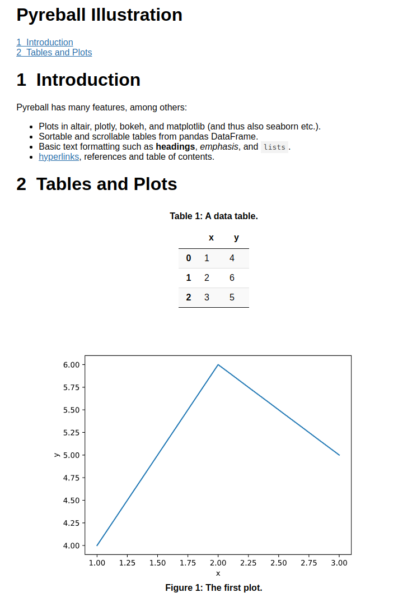

# Pyreball

<p style="text-align: center">


[](https://pypi.python.org/pypi/pyreball)
[](https://github.com/psf/black)
[](https://github.com/karelvaculik/pyreball/actions/workflows/tests.yml)

</p>

Python reporting tool that generates HTML reports from Python scripts.

Main features:

- Plots in altair, plotly, bokeh, and matplotlib (and thus also seaborn etc.).
- Sortable and scrollable tables from pandas DataFrame.
- Basic text formatting such as headings, emphasis, and lists.
- Hyperlinks, references and table of contents.

The main motivation is to allow the users to
create persistent reports in the form of interactive HTML pages from scripts retaining the Python syntax. The advantage
of *regular* Python scripts is that they are easy to maintain, can be refactored quickly through various IDEs, etc.

Pyreball is designed not to require any dependencies, unless you decide to use them. For example, if you decide to print
pandas DataFrames to tables and plot altair charts, you need to install pandas and altair.

Note that Pyreball is still in early stages of development, so there can be some breaking changes between released
versions.

## Install

```shell
pip install pyreball
```

## Usage

Create a regular python script, for example `report.py`:

```python
import matplotlib.pyplot as plt
import pandas as pd
import pyreball as pb
import seaborn as sns

pb.set_title("Pyreball Illustration")

pb.print_h1("Introduction")

pb.print_div(
    "Pyreball has many features, among others:",
    pb.ul(
        "Plots in altair, plotly, bokeh, and matplotlib (and thus also seaborn etc.).",
        "Sortable and scrollable tables from pandas DataFrame.",
        f'Basic text formatting such as {pb.bold("headings")}, {pb.em("emphasis")}, and {pb.code("lists")}.',
        f'{pb.link("hyperlinks", "https://www.python.org/")}, references and table of contents.',
    ),
)

pb.print_h1("Tables and Plots")

# Print a table
df = pd.DataFrame({"x": [1, 2, 3], "y": [4, 6, 5]})
pb.print_table(df, caption="A data table.")

# Plot a graph
fig, ax = plt.subplots()
sns.lineplot(x="x", y="y", ax=ax, data=df)
ax.set(xlabel="x", ylabel="y")
pb.plot_graph(fig, caption="The first plot.")
```

In this particular example, we use several 3rd party packages so we also need to install them:

```shell
pip install pandas matplotlib seaborn
```

Then generate an HTML report by running:

```shell
pyreball report.py
```

`pyreball` command will generate `report.html` with the final report that should look like this:



Script `report.py` and a few other examples can be found in `examples` folder. For example, `longer_report.py`
illustrates most of the Pyreball's features, while `sample_plots.py` shows different plotting libraries.
To install all dependencies needed for these examples, run:

```shell
pip install -r requirements_examples.txt
```

The command above is assumed to work with Python 3.9 - 3.11.
If you are using Python 3.8, older dependencies are needed, so `requirements_examples_py38.txt`
can be used.

## Pyreball Settings

The default parameters are stored in Pyreball's `config.ini` file. This config looks like
this:

```
[Parameters]
toc = yes
align-tables = center
numbered-tables = yes
sortable-tables = no
full-tables = yes
align-plots = center
numbered-plots = yes
matplotlib-format = svg
matplotlib-embedded = yes
numbered-headings = yes
page-width = 80
keep-stdout = yes
```

This config says that each table should be centered, each page should have a table of contents (toc), etc.
It is not recommended to modify the default Pyreball's config file. Instead, run the following command to generate
the copy of configs:

```shell
pyreball-generate-config
```

By default, the configs will be copied to `<HOME>/.pyreball/` directory, which can be changed by optional
`--output-dir` parameter. Once generated, the `config.ini` can be modified and it will be used by Pyreball.

Each config value can be also overridden by specific cli option of `pyreball` command (e.g. `--center-tables=no`).
This is useful if non-default settings should be applied to specific files. For example, the following command
overrides parameters `full-tables` and `page-width`:

```shell
pyreball --full-tables=no --page-width=100 script.py
```

Note that all parameters must be set before the positional argument, because otherwise they would be interpreted
as script's arguments - see below.

Some parameters can be overridden even on the level of individual function calls. For example, parameter `center`
of `print_table` function can override both `--center-tables` cli option and `center-tables` in `config.ini`.

To summarize, Pyreball reads settings from its default config file. If a config file is generated by
`pyreball-generate-config`, then this generated config is used instead. If cli parameters are provided, they
override the settings from config files. If parameters are set via Python function parameters, they override everything.

Pyreball uses the name of the input script and its directory to derive the path of the output file by default.
In order to change this output path, use `--output-path` option, for example:

```shell
pyreball --output-path=report_123.html report.py
pyreball --output-path=mydir/mysubdir/report_456.html report.py
pyreball --output-path=mydir/mysubdir report.py
```

Run `pyreball --help` to see the command help. It also shows the possible values for both cli and `config.ini`.

### Custom Script Arguments

Sometimes, you might want to pass custom arguments into the Python script that is used to generate the report.
To do so, pass all your arguments after Pyreball's positional arguments. You can also use `--` to delimit the
arguments to improve readability.
For example, you can try this on `custom_arguments.py` example script by calling:

```shell
pyreball --page-width=90 custom_arguments.py --sum 23 25 24
pyreball --page-width=90 custom_arguments.py -- --sum 23 25 24
```

## Setting up Pyreball in PyCharm

There is no plugin but you can use it as an "external tool".

In PyCharm, go `PyCharm -> Preferences... -> Tools -> External Tools` and add a new tool with the following settings:

- Name: `pyreball`
- Description: `pyreball`
- Program: `$PyInterpreterDirectory$/pyreball`
- Arguments: `$FilePath$`
- Working directory: `$ProjectFileDir$`
- Advanced Options -> Output filters: `$FILE_PATH$:$LINE$:$COLUMN$:.*`

Then it is possible to run `pyreball` on the open Python script by clicking
`Tools -> External Tools -> pyreball` or by right-clicking on the script and then selecting
`External Tools -> pyreball` from the context menu.

The work can be simplified even further by creating action icon for `pyreball` in the main toolbar. Navigate to
appropriate menu by opening
`PyCharm -> Preferences -> Appearance & Behavior -> Menus and Toolbars -> Main Toolbar ...`, where you *add action*
that will point to external tool `pyreball`. It is also possible to set up a keyboard shortcut for this external tool
in `PyCharm -> Preferences -> Keymap`.
